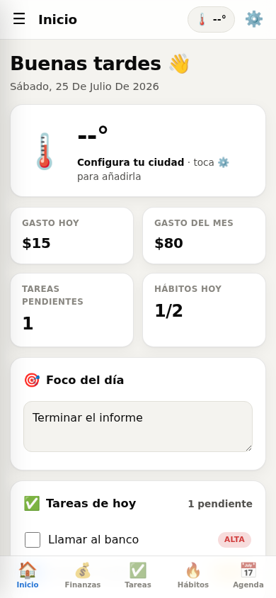
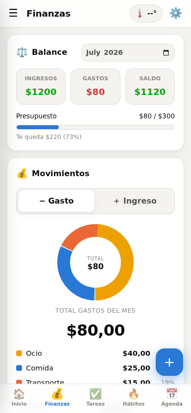

# 📊 Panel Personal

Tu centro de mando diario: **finanzas, tareas, hábitos, calendario y clima** en una sola
app. Mobile-first, instalable como PWA y **local-first** — tus datos viven en tu navegador
(`localStorage`) y funciona sin cuenta ni servidor. Opcionalmente puedes activar una
**copia en la nube** (con cifrado de extremo a extremo) para pasar tus datos entre
dispositivos.

## ✨ Funciones

- **💰 Finanzas Pro** — gastos e ingresos, saldo neto del mes, gráfico por categoría,
  resumen de los últimos 6 meses, **presupuesto mensual con alerta** y **presupuesto por
  categoría**, **metas de ahorro con fecha límite** (te dice cuánto ahorrar/mes) e
  **insights** ("gastaste X% más/menos que el mes pasado"). Incluye **categorías
  personalizables**, **gastos fijos** e **ingresos recurrentes** (alquiler, nómina,
  suscripciones…) que se registran solos cada mes, **edición** de movimientos y un
  **buscador/filtro** por nota, categoría y tipo.
- **✅ Tareas** — prioridades, **agenda** (agendar a fechas futuras), tareas que se arrastran
  al día siguiente, **recordatorio** de las tareas de hoy al abrir la app, **tareas
  recurrentes**, **edición** de tareas y **temporizador Pomodoro** con aviso.
- **🔥 Hábitos** — seguimiento diario con **racha** y vista de la semana.
- **📅 Calendario** — toca un día para ver gastos, tareas, hábitos y el **clima** de esa fecha.
- **🌤️ Clima en vivo** vía [Open-Meteo](https://open-meteo.com) (sin API key).
- **📱 App instalable** (PWA) que funciona **offline**, con **atajos** de instalación y
  pantalla de inicio ("Añadir gasto", "Nueva tarea").
- **💾 Respaldo** — exportar/importar en JSON y exportar gastos a CSV.
- **☁️ Copia en la nube (opcional)** — inicia sesión con un **enlace mágico** (sin
  contraseñas) y **sube/baja** tu estado a tu cuenta para moverlo entre dispositivos, con
  **cifrado de extremo a extremo** opcional. Desactivada por defecto; se activa en unos
  minutos con [Supabase](https://supabase.com) — ver [`docs/CLOUD_SETUP.md`](docs/CLOUD_SETUP.md).

## 📸 Capturas

  
  

## 🚀 Uso

Abre `index.html` en tu navegador, o publícalo con **GitHub Pages**:

1. Sube estos archivos al repositorio.
2. **Settings → Pages** → _Branch_: `main` / carpeta `/ (root)`.
3. Entra a `https://TU-USUARIO.github.io/TU-REPO/` y, en el móvil, usa
   _Añadir a pantalla de inicio_ para instalarla.

## 🗂️ Estructura

| Archivo                 | Qué es                                                                                                                                                                                                                         |
| ----------------------- | ------------------------------------------------------------------------------------------------------------------------------------------------------------------------------------------------------------------------------ |
| `index.html`            | Estructura HTML de la app (sin dependencias)                                                                                                                                                                                   |
| `css/style.css`         | Estilos de la app                                                                                                                                                                                                              |
| `js/*.js`               | Lógica de la app, dividida por sección (estado, finanzas, tareas, hábitos, calendario, clima, respaldo, pomodoro, etc.). Se cargan como scripts clásicos (sin build step) para que la app siga abriendo directo con `file://`. |
| `js/supabase-config.js` | Config de la copia en la nube (URL + clave `anon`); vacío = función desactivada                                                                                                                                                |
| `supabase/schema.sql`   | Tabla `backups` + políticas RLS para la copia en la nube                                                                                                                                                                       |
| `docs/CLOUD_SETUP.md`   | Guía para activar la copia en la nube con Supabase                                                                                                                                                                             |
| `manifest.webmanifest`  | Metadatos de la PWA                                                                                                                                                                                                            |
| `sw.js`                 | Service worker (cache offline)                                                                                                                                                                                                 |
| `icon.svg`              | Ícono de la app                                                                                                                                                                                                                |

## ☁️ Copia en la nube (opcional)

Por defecto la app es 100 % local. Si quieres pasar tus datos entre el móvil y el PC sin
exportar/importar a mano, puedes conectar un proyecto gratuito de **Supabase**: inicias
sesión con un enlace mágico y usas **Subir/Bajar** desde _Ajustes_. Todo se habla por
`fetch` contra la API de Supabase (sin añadir dependencias) y puedes activar **cifrado de
extremo a extremo** para que el servidor solo guarde texto cifrado.

Guía paso a paso: [`docs/CLOUD_SETUP.md`](docs/CLOUD_SETUP.md). Si dejas
`js/supabase-config.js` vacío, la función ni aparece.

## 🔒 Privacidad

Por defecto, todo se guarda localmente en tu dispositivo y lo único que sale a internet es
la consulta del clima. Si activas la copia en la nube, tu estado se guarda en **tu** proyecto
de Supabase (protegido por RLS, una fila por usuario); con la frase de cifrado activada, el
servidor solo ve texto cifrado. Nunca se publica la clave secreta `service_role`: la app
solo usa la clave `anon`, que es pública por diseño.
